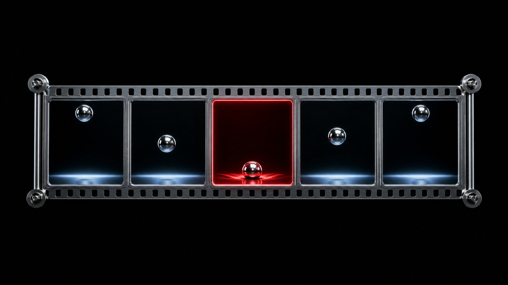
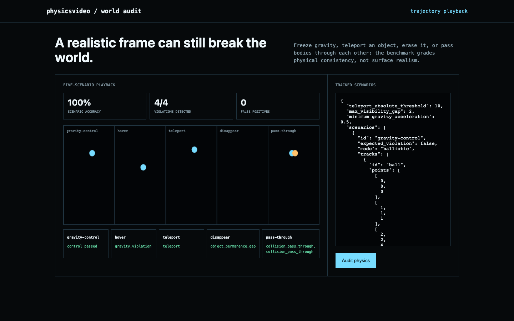

# physicsvideo

**Physical-consistency benchmark for generated video.**

Audit tracked video trajectories for gravity, teleportation, object permanence, and collision response, then render the benchmark to MP4.





## What ships

- Five-scenario benchmark with one clean control and four targeted failures
- Gravity acceleration, teleport, visibility-gap, and declared-collision response checks
- Actual OpenCV MP4 renderer for the committed scenario suite
- CLI, JSON API, animated visual workbench, Docker, tests, and CI

## Run it end to end

```bash
python -m venv .venv && source .venv/bin/activate
python -m pip install -e .
physicsvideo demo
physicsvideo render scenarios.mp4
physicsvideo serve
```

## Demo result

The benchmark contains a valid falling-ball control plus hover, teleport, disappearance, and collision pass-through failures. The frozen checks detect all four violations with zero false positives: 5/5 scenario accuracy.

## Current basis

- [How Far Is Video Generation from World Model: A Physical Law Perspective, ICML 2025](https://proceedings.mlr.press/v267/kang25g.html)
- [PhyCoBench](https://arxiv.org/abs/2502.05503)

## Scope

The checks operate on tracked trajectories. Appearance realism, deformable bodies, camera motion, occlusion semantics, and unobserved forces need richer task-specific evaluation.

## Test

```bash
python -m unittest discover -s tests -v
```

MIT licensed.
